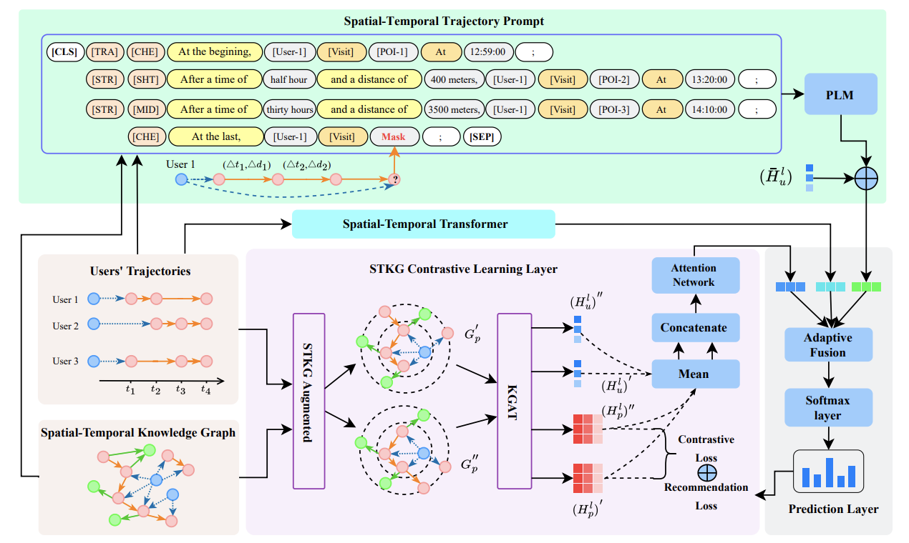

# STKG-PLM
Next-POI Recommendation with Spatial-Temporal Knowledge Graph and Prompt Pre-trained Language Model

## Model


## Datasets
| Dataset | TKY | IST | GWL
|--|--|--|--|
| # of users | 2078 | 5686 | 772 |
| # of POIs | 22205 | 32235 | 37692 |
| # of check-ins | 366485 | 628154 | 127072 |
| # of sessions | 46232 | 112842 | 14611 |
| # of entities | 24508 | 38246 | 38711 |
| # of relations | 23390 | 49732 | 15561 |
| # of triplets | 708942 | 1401385 | 277224 |


## Method:
### Prepare data
Put the raw datasets `TKY.txt` or `IST.txt` in the folder `./datasets/Foursquare_*`,  which are renamed from e real-world datasets of Foursquare platform. Specifically, you need to put the `sample_POIs.txt` and `sample_Checkins.txt` in `./datasets/Foursquare_GWL` as the sampled raw data from Austin with `sample_gwl.py`. 

In each data folder, there is also a text file `time_dict.txt`, which is used to construct temporal prompt.

Select the dataset when processing raw data：
```shell
python data_pre.py --data IST/TKY/GWL
```

### Bert Mode
The Bert Model [TinyBert](https://huggingface.co/huawei-noah/TinyBERT_4L_zh) adapted to this code is open source on HuggingFace ，put `config.json`、`vocab.txt`、`pytorch_model.bin` in the folder `bert`，and then alter the content of `vocab.txt`.

line 1-7:
```
[PAD]
[TRA]
[CHE]
[STR]
[SHT]
[MID]
[LNG]
```

line 105-108:
```
[UNK]
[CLS]
[SEP]
[MASK]
```

### Train & Eval model
We integrated training, testing, and validation of the model in a single run to get results across three datasets.

Note: the folder `/bert` is corresponding to the parameter `--bert_path bert` in command. And `--bert_hidden` need to be set the same as the `hidden_size` in `/bert/config.json`.

Train Command：(better set batch_size: 32/64, lr: 0.001/0.005)
```shell
python runner.py --dataset_name *** --save_name *** --train_model STKG_PLM/Bert4PR/GRU --load_ckpt True/False --lr 0.001 --batch_size 64 --bert_path 'bert' --bert_hidden 312
```

Rewrite the command in `run.sh` and run the shell script :

```shell
./run.sh
```

Training results are saved in the peer folder `/output`, including `.pt` model file and `xlsx` result file.


Test Command：
``` shell
python runner.py --save_name *** --train_model SKTG_PLM --do_eval True --batch_size 64 --bert_path 'bert' --bert_hidden 312
```
